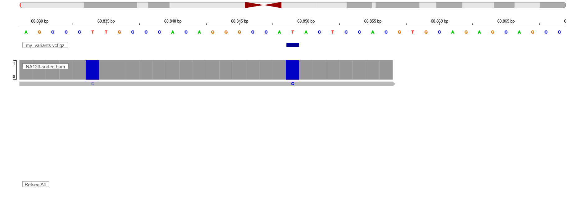

**Biocomputing Assignment

**1. #Creating the singularity Trimmomatic definition file.:
A singularity container was created to run Trimmomatic using Ubuntu 22.04 as the base image.
    The steps were as follows: Created a trimmomatic definition file called trimmomatic.def. 
                               Used Docker bootstrap with ubuntu:22.04
                               Installed the following dependenices: - default-jre
                                                                     - wget
                                                                     - unzip
                                Downloaded Trimmomatic v0.39
                                Set environment variable and runscript
    Build command: singularity build trimmomatic.sif trimmomatic.def

**2. Nextflow Pipeline
    This pipeline processes pair-end WGS data through the following steps:
        FastQC: Quality check of raw reads.
        Trimmomatic: Low quality reads and adapters were removing using the singularity container.
        BWA: Alignment of clean reads to reference genome (chromosome 19)
        SAMtoBAM: Comversion of SAM files to sorted BAM files using samtools.
        VARCALL: Variant calling to produce a vcf file using bcftools.
    Input: Paired-end FASTQ files
    Output: Trimmed FASTQ files
             SAM/BAM alignment files
             VCF file containing variants
    The following tools were loaded to run the pipeline: fastqc, bwa, samtools and bcftools.
    To tun the pipeline: ./run-pipe OR nextflow run main.nf -config nextflow.config
    After running the pipeline the vcf file was saved in vcf directory which is the output directory which was in the wgs/pipeline directory.

**3. Storing VCF file into the SQLite3 Database
    The final variants of the vcf file were extracted and stored in the SQLite3 database table called "variants.db".
    The vcf file was converted into a csv file first to remove the extra notes and columns and have only clean spreadsheet with the needed columns.
    The following steps in SQLite3 Databse: 
        Create table called variants which has the following columns:
            Chromosome TEXT: -The chromosome identifier
            Position INTEGER: -The loaction of a variant in a chromosome.
            Reference_allele TEXT: -The nucleotide base in the reference genome
            Alternative_allele TEXT: -The observed mutation in the genome.
            Quality REAL: The Phred quality score.
        After creating table, the variants.csv file was imported in the table.
**4. Variant Visualization:
The workflow included exporting variants from a SQLite database, converting them to VCF format, and performing visual validation using IGV.
## Methods
1. **Data Extraction**: Variants were queried from `variants.db` and formatted into a VCF.
2. **Indexing**: The VCF was compressed with `bgzip` and indexed using `tabix`.
3. **Visualization**: IGV (Integrative Genomics Viewer) was used to load the VCF track alongside the aligned reads (`NA123-sorted.bam`).
To validate the variants stored in `variants.db`, I exported the data to VCF format and visualized it alongside the aligned sequencing reads (BAM) using IGV.
The variants identified in the database were cross-referenced with the raw sequencing data.
**IGV Visualization:
Below is a screenshot of a validated variant at position **chr19:60,849:**
Below is a screenshot confirming a **T -> C** mutation. The top track shows the VCF prediction, while the BAM track shows the actual read support.

**Observations:**
* The reference genome shows a **T** (Red) at this position.
* The VCF track correctly identifies a variant.
* The BAM alignment shows a clear **C** (Blue) mismatch in the reads, validating the call.

**5.The repository contains:
    Trimmomatic.def file
    Nextflow pipeline: main.nf
    nextflow.config
    variants.db (SQLite3 Databse)
    README.md
        
